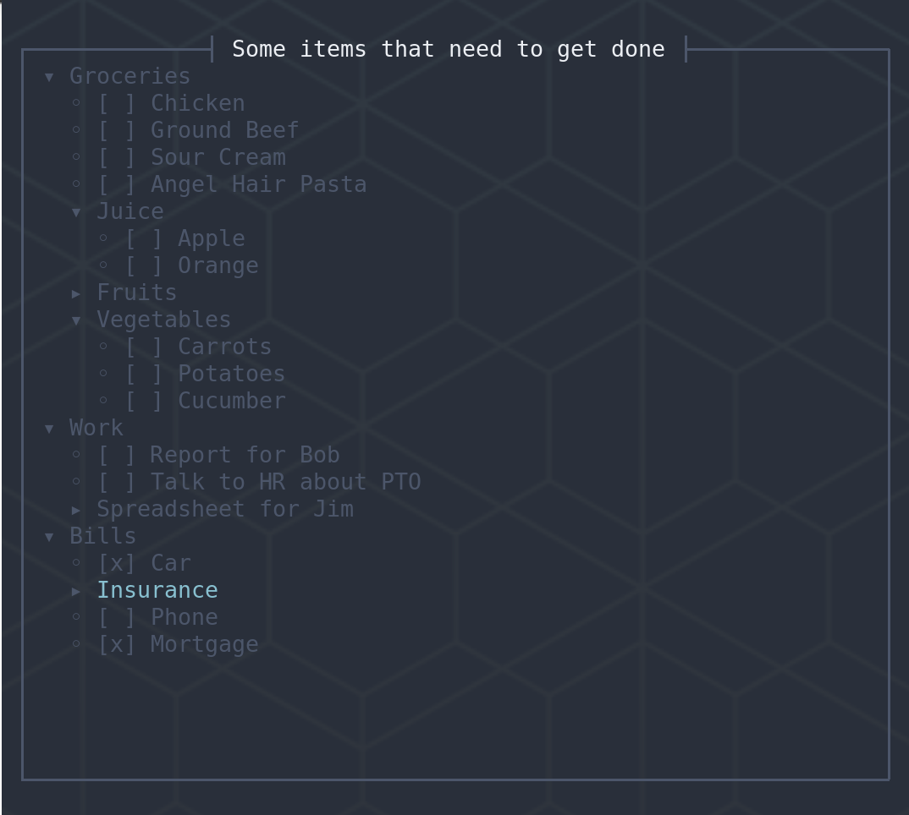

# Lister: Navigate Markdown Lists of Things

Lister is a small tool to help you navigate large markdown lists. It does not process a full markdown format; just a subset of it for its display. Lister allows you to collapse and navigate the tree interactively, and will soon be able to modify the list and write it back out in a very similar fashion to how it was written, so the markdown file itself can be used as a database.



## Installation

```bash
cargo install lister-cli
```

This will install the `lister` binary in `$CARGO_HOME/bin`.

## Usage

Type `lister <filename>` or `lister --help` for options. Press `?` for help once in the UI, and you can press `q` to quit to your shell.

## Format

Rules for the format are below.

Checkboxes are supported and will eventually, along with the saving features, allow for an editor-independent task management system. There is still a lot of work to do before we're there. They will hopefully become powerful features.

If you need an example of the format, [look here](https://github.com/erikh/lister/raw/main/example.md). For now:

-   Titles start with `#`: they must be presented at the top of the file before any other non-whitespace content. Files may only have one title.
-   Each list item starts with `-` or `*` and may contain an optional `[ ]` with an `x` in replacement for the space to indicate checked items. Following that, any text is the item's title, and may continue across multiple lines until the next list item is encountered or the end of file.
-   List nesting is controlled by whitespace indentation, which must be equi-distant from the parent's `-` mark for all items, outside of that, feel free to indent how you want. Tab characters are not expanded into spaces, and are only treated as one character, which may cause painful results if mixing with normal space characters.
    -   Every nesting level of the tree has equivalent whitespace on all lines. Out-denting or indenting items even by one space will produce additional unexpected levels of nesting.
-   Use the following keys to navigate the tool:
    -   `?` for interactive help (`?` again or `q` to quit)
    -   `q` to quit the program
    -   `j` or the down arrow to move down
    -   `k` or the up arrow to move up
    -   Enter to expand sub-trees

## Author

Erik Hollensbe <erik+github@hollensbe.org>

## License

MIT
